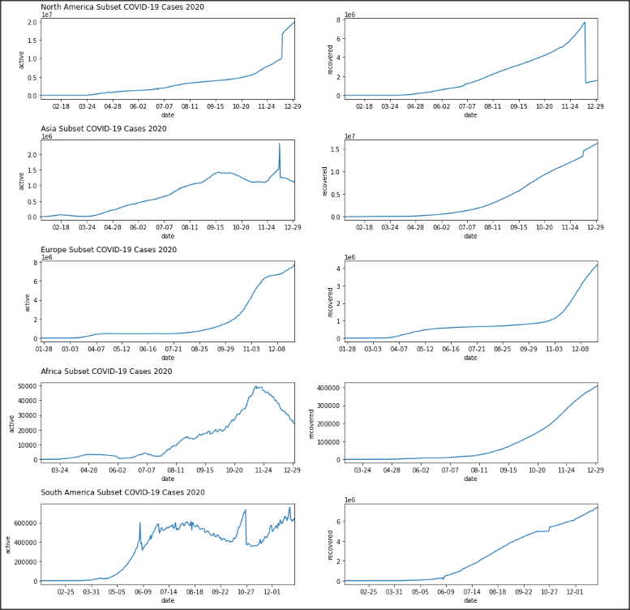
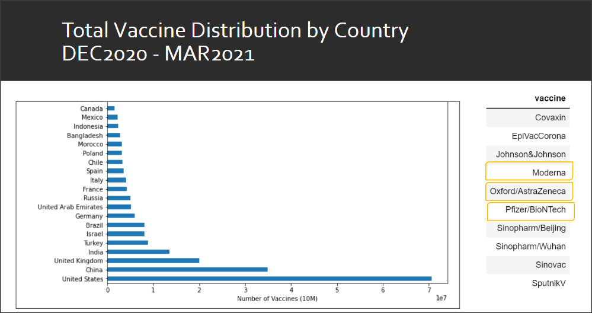
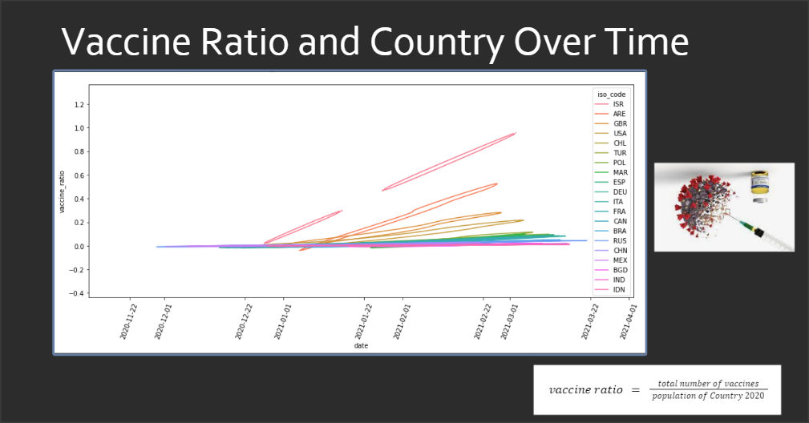

# **COVID-19 Case Study 2020**
### A Time Series Comparison of COVID19 Cases, Vaccinations and the Global Population

###### The purpose of this data science project is to visualize the effective strategies for distribution of multiple vaccines as COVID19 continues to spread billions of people around the world are waiting for treatment or to be vaccinated. The shared responsibility of maintaining a healthy environment rests on the shoulders of each individual, vaccinated or not. When the death toll from the corona virus disease was determined to be _unstoppable_ there were many rules put in place. This shifted the focus of communities around the world to emphasize biosafety governance.

###### Each country's medical infrastructure continues to play a vital role for everyone. In the rare instance of this pandemic the data that has been captured can result in a good approximation of how the current technological advancements help reduce the time that it takes to control the spread of the disease. The health and status of each country is changing constantly and could never be understood fully when contemplating the epidemiology with reference to 1 disease.

#### Active and Recovered COVID19 Cases by Continent

  

#### 

#### Vaccine List _12/2020 to 03/2021_

  

###### There are 20 countries listed here and all have had vaccine counts greater than 1 million. This is good considering that this is for a 3 month period after the vaccines were approved for clinical trials at the end of 2020. Pfizer was the vaccine distributed to the most countries, then AstraZeneca, then Moderna. Multiple vaccines were given to each country and they were recorded in multiples, I was not able to derive the individual vaccine count for all.

#### Vaccine Country Ratio 

  

###### The vaccine ratio is defined as single doses administered to the entire population of the country. The top five countries with highest single vaccine ratio per capita in March of 2021 were Israel at 92%, United Arab Emirates at 52%, United Kingdom at 29%, United States at 21% and Chile at 17% coverage.
